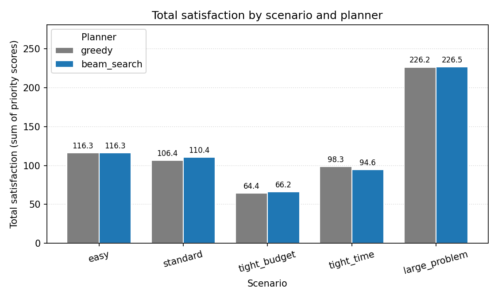
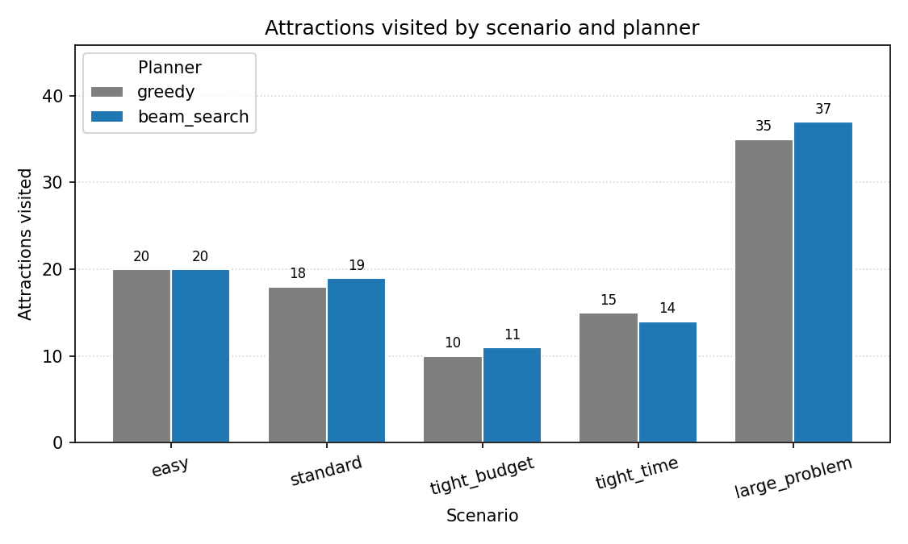
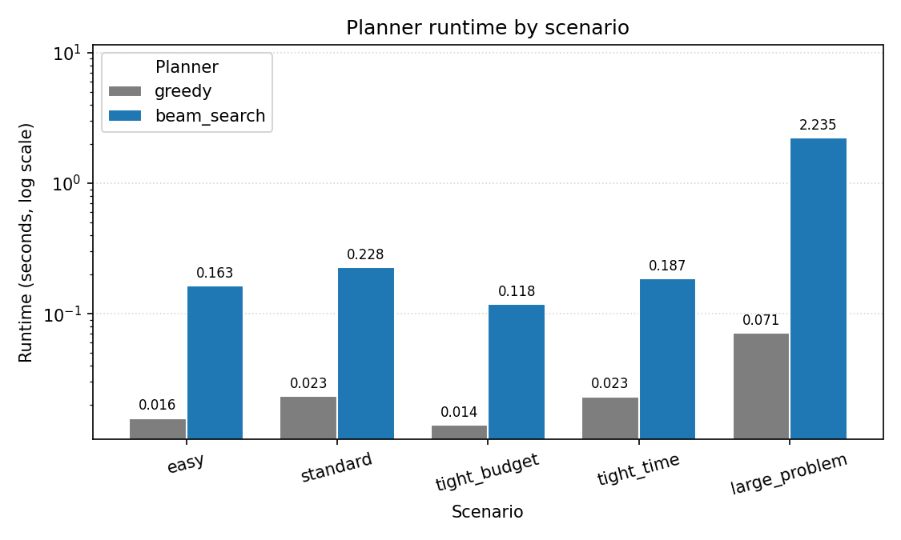
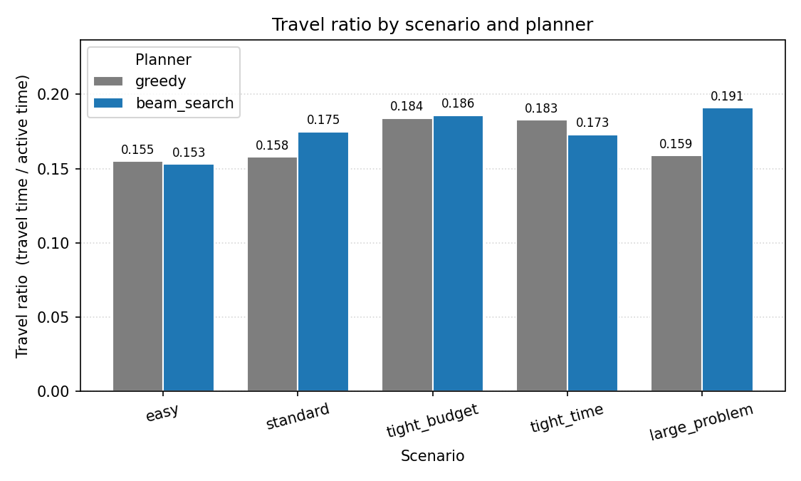

## 1. Introduction

This project implements an end-to-end prototype for constrained travel itinerary planning. The system takes synthetic attraction data and trip parameters as input, then produces a multi-day visit schedule. The itinerary must satisfy hard constraints such as budget, daily available time, attraction opening hours, visit duration, travel time between places, and maximum waiting time, while trying to maximize total satisfaction.

The project uses synthetic data only. It does not call real travel platforms, map APIs, or external optimization services. The core planning logic was implemented specifically for this project, including a greedy baseline and a beam search planner. `numpy` and `pandas` are used for data generation and tabular handling, while `matplotlib` is used for result visualization.

Beyond producing a single itinerary, the prototype also includes a repeatable experiment pipeline. The command-line interface can generate datasets, run one scenario or a full scenario sweep, validate every produced itinerary, write readable Markdown outputs, and render charts. This makes the project more than a one-off script: it is a small experimental framework for comparing planning strategies under different resource constraints.

## 2. Problem Definition

The input includes a set of candidate attractions, a travel-time matrix containing a hotel node, and a trip configuration. Each attraction has an ID, name, category, two-dimensional coordinates, cost, visit duration, opening time, closing time, and priority score. The trip configuration includes total budget, number of days, daily start and end time, and maximum acceptable waiting time.

The goal is to generate a multi-day itinerary that satisfies all hard constraints and maximizes total satisfaction:

```text
total_satisfaction = sum(priority_score for all visited attractions)
```

This is naturally related to a multi-day Orienteering Problem with time windows and budget constraints. In practice, the difficulty comes from the interaction between several resource limits at once. A visit that looks attractive in isolation may become infeasible after accounting for travel time, waiting before opening, remaining budget, and the need to return to the hotel before the day ends. Because exact optimization can be expensive and would add substantial implementation complexity, this project uses heuristic search methods to build a working prototype that remains easy to explain and evaluate.

## 3. Constraints and Assumptions

The planner checks the following hard constraints:

| Constraint | Meaning |
| --- | --- |
| budget | Attraction cost cannot exceed the remaining budget |
| opening hours | A visit must finish before the attraction closes |
| max waiting | Waiting after early arrival cannot exceed the limit |
| day window | The traveler must be able to return to the hotel before the day ends |
| no duplicates | The same attraction cannot be visited more than once |
| known attractions | Every attraction in the itinerary must exist in the dataset |

The feasibility checker applies these constraints one candidate at a time. It first rejects attractions that exceed the remaining budget, then computes arrival time from the current location, applies waiting if the attraction has not opened yet, checks whether the visit would end before closing, and finally verifies that the traveler can still return to the hotel by the configured daily end time. This design means feasibility is enforced during construction rather than repaired afterward.

The main modeling assumptions are: all data is synthetic; travel time is computed from two-dimensional distance and a fixed speed; each day starts and ends at the same hotel; opening hours are the same every day; user preference scores are fixed; and the system performs offline planning, so it does not handle real-time delays, congestion, or temporary closures.

## 4. Synthetic Dataset Design

`src/data_generator.py` creates six categories of attractions: museum, park, restaurant, landmark, market, and entertainment. Each category has different ranges for cost, visit duration, opening time, closing time, and score bias. For example, entertainment venues tend to be expensive and long, landmarks are usually short and high-value, and markets are cheap but often close earlier. This category-specific profiling makes the planner face meaningful trade-offs instead of choosing among nearly identical points.

Attraction locations are not fully random. They are generated around cluster centers to mimic real cities where points of interest often form districts or groups. This matters because routing quality depends heavily on spatial structure: if attractions were uniformly random, travel patterns would be less realistic and the benefit of route-aware search would be harder to see. The hotel is fixed near the map center, and the travel matrix includes `"hotel"` plus all attraction IDs.

Travel time is computed from Euclidean distance divided by a constant speed of 30 km/h, then converted into minutes. This is a simplification, but it produces a symmetric travel-time matrix that is easy to reason about and sufficient for controlled experiments. The generator is seeded, so experiments are reproducible.

When a single scenario is run, the system saves data to:

```text
data/<scenario>/attractions.csv
data/<scenario>/travel_matrix.csv
```

## 5. Planning Algorithms

### Greedy Baseline

`plan_itinerary` chooses the best currently feasible attraction at each step. The composite score combines three normalized components:

```text
composite_score =
    0.40 * normalized(priority_score)
  + 0.35 * normalized(time_efficiency)
  + 0.25 * normalized(cost_efficiency)
```

where:

```text
time_efficiency = priority_score / ((travel + wait + duration) / 60)
cost_efficiency = priority_score / max(cost, 1.0)
```

This design makes the baseline more meaningful than a naive "highest score first" rule. It still favors interesting attractions, but it also penalizes options that consume too much time or budget for the value they deliver. The method is fast and easy to explain, but it only looks one step ahead and can spend budget or time too early.

### Beam Search

`plan_itinerary_beam_search` keeps the top `K` partial itinerary states at the same time. Each state stores completed days, the current day's partial plan, the current time and location, the visited set, and remaining budget. At each round, the algorithm expands every feasible next visit and keeps only the best `K` states.

The state score combines several objectives:

```text
state_score =
    1.0 * total_satisfaction
  + 2.0 * num_attractions
  + 3.0 * travel_efficiency
  + 8.0 * category_diversity
  + 0.15 * remaining_budget
```

This makes beam search less myopic than greedy. It can keep multiple promising partial itineraries alive instead of committing immediately to one path. At the same time, the scoring function is still heuristic rather than optimal, so its behavior depends on the chosen weights. The `tight_time` scenario shows this clearly: when time is the real bottleneck, rewarding remaining budget can have a negative side effect and lead the search toward cheaper but not necessarily better time usage.

Beam search and the greedy baseline share the same hard-constraint checking function. Their difference is the search strategy, not the constraint definition, which makes the comparison fairer.

## 6. Prototype Implementation

The main code structure is:

```text
src/
  data_generator.py     synthetic attractions and travel matrix
  scenarios.py          five predefined experiment scenarios
  planner.py            constraints, greedy planner, beam search planner
  evaluator.py          feasibility validation and metric calculation
  formatter.py          optional readable itinerary printing
  visualizer.py         matplotlib charts
  experiment_runner.py  scenario and algorithm sweep
  main.py               argparse command-line entry point
```

The implementation is organized as a pipeline. `main.py` parses command-line arguments and dispatches to either a single run or a full experiment sweep. `data_generator.py` creates the synthetic environment. `planner.py` constructs an itinerary. `evaluator.py` then independently validates the result and computes metrics. `experiment_runner.py` repeats the process across scenarios and planners, writes `outputs/experiment_results.csv`, and generates Markdown itineraries plus charts.

One useful design choice is that validation is separate from planning. The planner tries to be correct by construction, but `validate_itinerary` re-checks the final itinerary independently for over-budget visits, excessive waiting, visits that run past closing time, inability to return to the hotel, duplicate visits, too many days, and unknown attraction IDs. This reduces the chance that planner bugs silently contaminate evaluation results.

Common commands:

```bash
python src/main.py
python src/main.py --show-itinerary
python src/main.py --run-experiments
python src/main.py --make-charts
python -m unittest discover -s tests -v
```

## 7. Experimental Scenarios

| Scenario | Attractions | Days | Budget | Daily window | Beam width | Purpose |
| --- | ---: | ---: | ---: | --- | ---: | --- |
| easy | 20 | 3 | $400 | 08:00-22:00 | 5 | Loose constraints |
| standard | 30 | 3 | $200 | 09:00-21:00 | 5 | Reference case |
| tight_budget | 30 | 3 | $80 | 09:00-21:00 | 5 | Budget is tight |
| tight_time | 30 | 3 | $200 | 10:00-17:00 | 5 | Time is tight |
| large_problem | 50 | 5 | $400 | 09:00-21:00 | 10 | Scalability test |

All default experiments use random seed 42. Together, these scenarios provide a useful range: one easy setting where both planners should perform well, two settings where a single resource becomes strongly binding, and one larger case that stresses runtime and search breadth.

## 8. Evaluation Metrics

The system first uses `validate_itinerary` to independently check feasibility, then computes metrics. The main metrics are feasibility, number of violations, attractions visited, total cost, remaining budget, total satisfaction, total visit time, total travel time, travel ratio, category diversity, daily balance, and runtime.

Two derived metrics are especially informative:

```text
travel_ratio = total_travel_minutes / (total_travel_minutes + total_visit_minutes)
daily_balance = max(1 - stdev(visits_per_day) / mean(visits_per_day), 0)
```

`travel_ratio` captures how much of the traveler's active time is spent moving instead of visiting attractions. Lower is generally better. `daily_balance` measures whether visits are spread relatively evenly across days. A value near 1.0 means the itinerary is well distributed; lower values indicate front-loading or uneven use of trip days.

This combination of metrics is important because no single number captures itinerary quality well. A planner could maximize satisfaction by creating a long, travel-heavy route, or preserve perfect budget usage while producing an imbalanced schedule. The evaluation therefore looks at quality, efficiency, diversity, and practicality together.

## 9. Experimental Results

The results come from `outputs/experiment_results.csv`:

| Scenario | Algorithm | Visits | Cost | Remaining | Satisfaction | Visit min | Travel min | Travel ratio | Diversity | Balance | Feasible | Runtime |
| --- | --- | ---: | ---: | ---: | ---: | ---: | ---: | ---: | ---: | ---: | --- | ---: |
| easy | greedy | 20 | $352 | $48 | 116.3 | 1680 | 308.0 | 0.155 | 1.00 | 0.62 | OK | 0.0158 |
| easy | beam_search | 20 | $352 | $48 | 116.3 | 1680 | 302.5 | 0.153 | 1.00 | 0.62 | OK | 0.1632 |
| standard | greedy | 18 | $200 | $0 | 106.4 | 1230 | 230.0 | 0.158 | 1.00 | 0.40 | OK | 0.0233 |
| standard | beam_search | 19 | $198 | $2 | 110.4 | 1305 | 277.3 | 0.175 | 1.00 | 0.67 | OK | 0.2279 |
| tight_budget | greedy | 10 | $80 | $0 | 64.4 | 600 | 135.4 | 0.184 | 0.67 | 0.00 | OK | 0.0140 |
| tight_budget | beam_search | 11 | $80 | $0 | 66.2 | 735 | 168.5 | 0.186 | 0.83 | 0.04 | OK | 0.1184 |
| tight_time | greedy | 15 | $199 | $1 | 98.3 | 1005 | 225.6 | 0.183 | 0.83 | 0.80 | OK | 0.0232 |
| tight_time | beam_search | 14 | $163 | $37 | 94.6 | 1020 | 213.5 | 0.173 | 1.00 | 0.88 | OK | 0.1870 |
| large_problem | greedy | 35 | $400 | $0 | 226.2 | 2340 | 441.2 | 0.159 | 1.00 | 0.41 | OK | 0.0714 |
| large_problem | beam_search | 37 | $387 | $13 | 226.5 | 2355 | 554.9 | 0.191 | 1.00 | 0.65 | OK | 2.2351 |

The main findings are:

1. Beam search performs better than greedy in `standard`, `tight_budget`, and `large_problem`, and ties greedy in `easy`.
2. `tight_time` is the exception. Since time, not budget, is the scarce resource, the remaining-budget heuristic in beam search has a negative side effect, leading to fewer visits and lower satisfaction.
3. Beam search usually produces more balanced daily schedules. In the `standard` scenario, daily balance improves from 0.40 to 0.67.
4. Beam search has higher runtime, but remains below one second for 20 to 30 attractions; in `large_problem` it takes about 2.24 seconds.
5. All experiment combinations satisfy the hard constraints, with no feasibility violations.

A closer interpretation by scenario is useful. In `easy`, both planners reach the same satisfaction and visit all 20 attractions, which suggests the constraints are loose enough that search sophistication provides little extra value. In `standard`, beam search gains one additional attraction and about four satisfaction points, showing that keeping multiple partial plans alive helps under moderate resource pressure. In `tight_budget`, the gain is modest but meaningful: beam search squeezes in one more visit and improves diversity because it can better trade off cheap attractions across days. In `large_problem`, the satisfaction gain is small, but beam search still visits two more attractions and substantially improves daily balance, which is a good sign that broader search becomes more useful as the space grows.

The `tight_time` result is especially informative because it exposes a weakness rather than a success. Beam search achieves a lower travel ratio and better balance, yet still loses on visits and satisfaction. That means its heuristic is not simply "bad overall"; instead, it is misaligned with the dominant resource in this specific scenario. This kind of failure case is valuable because it points directly to the next improvement: adaptive scoring that shifts weight away from remaining budget when time windows are the real bottleneck.

### 9.1 Visualized Outputs

The experiment runner also generates chart outputs under `outputs/charts/`. These figures help summarize the trade-offs discussed above and make the comparison easier to interpret in the rendered report.

{width=85%}

{width=85%}

{width=85%}

{width=85%}

The satisfaction and attraction-count charts confirm that beam search is usually stronger in the `standard`, `tight_budget`, and `large_problem` settings, while the runtime chart shows the expected computational cost of broader search. The travel-ratio chart adds nuance: lower travel ratio does not always imply higher satisfaction, as shown in the `tight_time` scenario, where better movement efficiency alone is not enough to overcome heuristic misalignment.

### 9.2 Representative Itinerary Output

Besides aggregate metrics, the system exports readable itinerary files under `outputs/itineraries/`. A representative example is the `standard` scenario solved with beam search. Its summary metrics are:

| Item | Value |
| --- | --- |
| Planner | beam_search, beam width 5 |
| Attractions visited | 19 |
| Total cost | $198 |
| Remaining budget | $2 |
| Total satisfaction | 110.4 |
| Travel ratio | 0.175 |
| Daily balance | 0.67 |

The first two days of this itinerary are densely packed, while the third day is lighter and finishes early, which matches the balance score of 0.67: better than greedy, but still not perfectly even. The detailed output also shows that the planner mixes landmarks, parks, markets, restaurants, and a museum or entertainment stop, illustrating that the diversity objective affects the final route.

For example, the `standard` beam-search itinerary begins Day 1 with `Victory Bridge`, `Zen Garden`, `Flower Market`, and `Skyline Tower`, then continues with `Rooftop Bistro`, `Concert Hall`, and `Lakeside Park`, returning to the hotel at 20:09. This demonstrates that the planner is not only maximizing scores, but also constructing a time-feasible day that respects opening hours and the hotel return requirement.

## 10. Reliability and Limitations

The project includes smoke tests in `tests/test_smoke.py`. These tests check dataset reproducibility, travel-matrix symmetry, the main feasibility failure modes, planner output structure, required evaluation keys, and end-to-end feasibility for both planners on the standard scenario. This is enough to support confidence in the prototype, but it is not the same as exhaustive verification.

The main limitations are: the project uses synthetic data only; the travel model is simplified; user preferences are fixed rather than learned; the planner does not re-plan in real time; beam search uses fixed heuristic weights; there is no comparison against an exact optimum; and the tests focus on representative smoke coverage rather than every edge case. In addition, the current evaluation uses one seed per default scenario, so the reported results show consistent examples rather than statistical averages over many random instances.

## 11. Future Improvements

Future work could add adaptive heuristic weights, real map data, stochastic travel times, user preference learning, a small-scale ILP optimal baseline, multi-objective search, within-day local optimization, and a simple web interface. Another strong extension would be repeated experiments across multiple seeds so that the report can present mean performance and variance instead of only one deterministic run per scenario.

## 12. Conclusion

This project builds an end-to-end constrained travel itinerary planning prototype, including synthetic data generation, hard-constraint modeling, a greedy baseline, a beam search planner, an independent validator, an experiment runner, and chart visualization. The experimental results show that beam search usually improves itinerary quality and daily balance, but can be misled by fixed heuristics when time becomes the dominant constraint. The prototype therefore succeeds both as a functional planner and as an experimental comparison platform.

Overall, the project satisfies the final project goal of building an AI-powered prototype, analyzing the planning problem, evaluating performance under multiple scenarios, and clearly identifying the code contributed for the solution.
